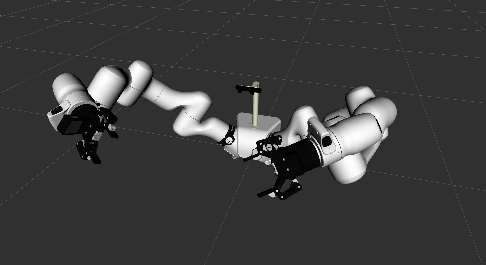
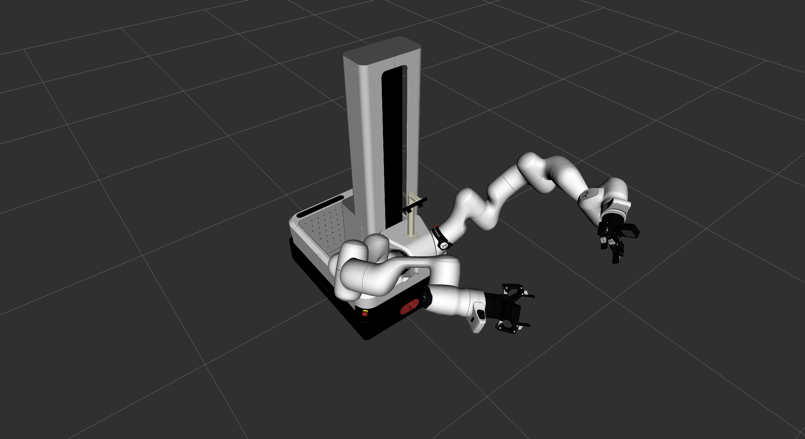

franka_vision_and_manipulation_kit
==================================

Package Overview
----------------

This package contains launch files and URDF for the Franka Vision and Manipulation Kit.

* **Robotiq Grippers** - Robotiq 2F-5 Grippers
* **Realsense Cameras** - RealSense D405 Depth Cameras
* **ZED Camera** - ZED Mini Camera

The package handles sensor configuration, driver launching, and RViz visualization for the complete kit.

Prerequisites
-------------

The following repositories are needed for the Franka Vision and Manipulation Kit to work:

* https://github.com/PickNikRobotics/ros2_robotiq_gripper
* https://github.com/realsenseai/realsense-ros
* https://github.com/stereolabs/zed-ros2-wrapper

Currently, ``franka_ros2`` does not provide a pre-built docker image or other environment where these prerequisites are already installed.
Please build your own environment with the help of the above links.
The ZED package needs `CUDA Drivers`_ and the `ZED SDK`_.

.. _CUDA Drivers: https://www.stereolabs.com/developers/release/latest/
.. _ZED SDK: https://www.stereolabs.com/developers/release/latest/

Usage
-----

Launch the kit with::

    ros2 launch franka_vision_and_manipulation_kit franka_vision_and_manipulation_kit.launch.py \
      [start_robotiq_grippers:=true|false] \
      [start_realsense_cameras:=true|false] \
      [start_zed_camera:=true|false] \
      [start_rviz:=true|false] \
      [use_mobile_platform:=true|false] \
      [config_file_path:=<path to config file>] \
      [xacro_file_path:=<path to robot xacro>]

Launch Arguments
^^^^^^^^^^^^^^^^

* ``start_robotiq_grippers`` (default: ``true``) - Start Robotiq grippers
* ``start_realsense_cameras`` (default: ``true``) - Start RealSense camera drivers
* ``start_zed_camera`` (default: ``false``) - Start ZED camera
* ``start_rviz`` (default: ``true``) - Start RViz visualization
* ``use_mobile_platform`` (default: ``false``) - Use mobile FR3 Duo instead of stationary FR3 Duo
* ``config_file_path`` (default: ``package://franka_vision_and_manipulation_kit/config/default_config.yaml``) - configuration file containing camera parameters and other kit settings.
* ``xacro_file_path`` (default: ``package://franka_vision_and_manipulation_kit/robots/vision_and_manipulation_kit.urdf.xacro``) - robot xacro file; accepts a filesystem path or a ``package://`` resource.

Configuration
-------------

Example configuration YAML file::

    head: #parameters for zed camera
      camera_model: zedm
      # more zed camera parameters, see https://www.stereolabs.com/docs/ros2/zed-node

    left_arm:
      gripper:
        type: 2f_85 # by default the vision and manipulation kit uses 2-finger 85cm grippers
        com_port: "/dev/serial/by-id/usb-FTDI_USB_TO_RS-485_XXXXXXXX-if00-port0" # check the IDs of connected devices with `ls /dev/serial/by-id/` and change it accordingly
      camera:
        serial_no: "_XXXXXXXXXXXX" # mind the leading underscore
        camera_namespace: left
        # ... more realsense camera parameters, see https://github.com/realsenseai/realsense-ros?tab=readme-ov-file#parameters
    right_arm:
      gripper:
        type: 2f_85
        com_port: "/dev/serial/by-id/usb-FTDI_USB_TO_RS-485_YYYYYYYY-if00-port0"
      camera:
        serial_no: "_YYYYYYYYYYYY"
        camera_namespace: right

Gazebo Simulation
-----------------

The Vision and Manipulation Kit can be simulated in Gazebo without physical hardware. Use the
``with_sensors:=true`` argument on the corresponding Gazebo launch file:

**FR3 Duo:**

.. code-block:: shell

    ros2 launch franka_gazebo_bringup gazebo_fr3_duo_example.launch.py with_sensors:=true

**Mobile FR3 Duo:**

.. code-block:: shell

    ros2 launch franka_gazebo_bringup gazebo_mobile_fr3_duo_example.launch.py with_sensors:=true

This simulates the kit's sensors (2× wrist D405 cameras, 1× ZED Mini head camera) and includes
Robotiq grippers instead of the default Franka Hand. See the
:doc:`franka_gazebo_bringup documentation <../../../franka_gazebo/franka_gazebo_bringup/doc/index>`
for full details on available topics and launch arguments.
